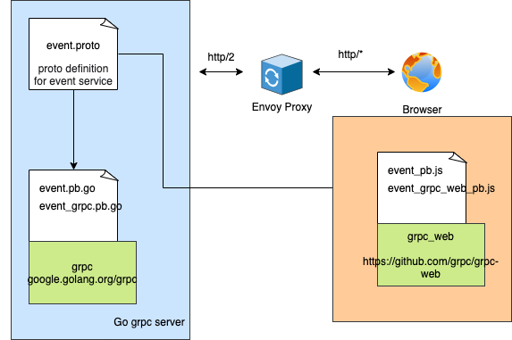

A Server Stream gRPC Service with a demo frontend application. 

The application uses [gRPC-Web](https://github.com/grpc/grpc-web) to enable full end-to-end gRPC service architecture all the way from client to server. However, gRPC-Web clients does need a translation layer to transform HTTP/1.1 calls to gRPC friendly calls (HTTP/2). [Envoy](https://www.envoyproxy.io/) proxy, which has gRPC-Web support built-in can be used as gateway for gRPC-Web to interact with grpc services.

## Environment:

### Docker, NodeJS, Golang

### System Install (In Mac OS):
```
  brew install protobuf
  brew install protoc-gen-grpc-web
  brew install grpcurl
```

## Running this project:

1. Setup and run go grpc service
```bash
  $ go mod download
  $ go run . # http://localhost:9000/
```

`protoc` is used to compile .proto files, which contain service and message definitions. Compiled files
are already commited in the repo. Regeneration commands are provided in Makefile. 

2. Run envoy proxy server ()
```bash
  $  docker-compose up
```

3. Run frontend app (inside `frontend` folder)
```bash
  $ npm run server # http://localhost:8000/
```

4. Generate event in backend server using grpcurl

```bash
  $ grpcurl --plaintext -d '{"Code":"MY_EVENT"}' localhost:9000 Event.BroadcastEvent
```

5. Observer event in the frontend

## Basic project architecture:




## Project description:

Blog Post coming soon.
